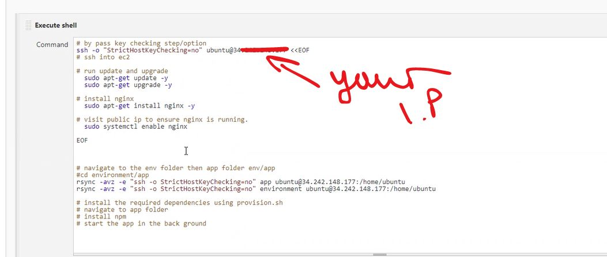

# CD PIPELINE INTERGRATION - deploying the app 

************************

## Using a jenkins job to install nginx with an ec2 instance

These are the following steps to launch nginx via an ec2 instance on AWS with jenkins 

1. **Create a fresh instance on AWS** if you need a recap on how to do that click on the link here  

2. **Make sure when you are configuring that security group of that instance** to allow for the follwing ports 


```port 22 for ssh```

```port 80 for html```

```port 3000 for local host```

```port 8080 for jenkins```

3. **Now launch that instance!** 


4. **Log onto jenkins and create a new project** follow the setting up of that here 

 But dont save and apply just yet we need to add a few things!


5. **At the bottom of the page in the execute shell box** add the following code : 
```
# By pass key checking step/option
ssh -o "StrictHostKeyChecking=no ubuntu@TYPE.YOUR.PUBLIC.IP.HERE.OF.EC2 <<EOF

# run update and upgrade 
sudo apt-get upgrade -y
sudo apt-get update -y

# install nginx
sudo apt-get install nginx -y

# enable nginx
sudo systemctl enable nginx

EOF
```





6. **Now click apply and save** at the bottom of the page.

7. **Now click run job on the left tab and wait for it to load** if its sucessful go to console output and you should see it loaded sucesfully. 


8. **Now put the public ip address of your intance into a url** if you was sucessfully you should see this page : 


Well done you, sucesfully configured and install nginx to your Instance using Jenkins!
**************************************************

## Using jenkins to deploy our application to the cloud

Now if we want to deploy our app data to the cloud using jenkisn we follow all the steps we did before but this one : 

1. **Where we put the script to install and run nginx** add the following commands after that : 

```
# Bypass key checking option using StrictHostKeyChecking and SSH into EC2
ssh -o "StrictHostKeyChecking=no" ubuntu@34.244.217.61 <<EOF
# Run update & upgrade
sudo apt-get update -y
sudo DEBIAN_FRONTEND=noninteractive apt-get upgrade -y
# Install, restart and enable Nginx service
sudo DEBIAN_FRONTEND=noninteractive apt-get install nginx -y
sudo systemctl restart nginx
sudo systemctl enable nginx

EOF
# Copy new code (app & environment folders) to App Instance
rsync -avz -e "ssh -o StrictHostKeyChecking=no" app ubuntu@34.244.217.61:/home/ubuntu
rsync -avz -e "ssh -o StrictHostKeyChecking=no" environment ubuntu@34.244.217.61:/home/ubuntu
# SSH back in, Navigate to and run script to install app dependencies
ssh -o "StrictHostKeyChecking=no" ubuntu@34.244.217.61 <<EOF
sudo chmod +x ~/environment/app/provision.sh
sudo bash ./environment/app/provision.sh
# Navigate to app directory
cd app
# Gracefully kill/start a new app process using pm2
pm2 stop all
pm2 start app.js app
EOF
```

2. **Now you can see if you add the public IP** to your url you  should see the app.


*********************************


