# CI/CD pipelines with Jenkins and Github
*****************************

## Creating a CI/CD pipeline


What do we want to do?

* We want to create a simple pipeline for CI/CD
* We want to do this using a code from a github repo 
* We want to push our code to github in one branch 
* Then automate the test merge and deploy

 ## First of all what is a CI pipeline?

 * A Continuous Integration (CI) pipeline is a set of automated processes that software development teams use to build, test, and deploy their code changes. 
 * The primary goal of a CI pipeline is to automate the steps involved in integrating new code into a shared repository and ensuring that it functions correctly with the existing codebase.

 
## When is a CI pipeline used?
* CI pipelines are used whenever there are code changes to integrate into a project's codebase.
* Developers trigger CI pipelines by pushing code changes to a version control system (e.g., Git) or by creating pull requests.
* In our case looking at the diagram we are pushing the code automatically to jenkins to test the code before it is either deployed or delivered.

## How does a CI pipeline work?
* When triggered, a CI pipeline retrieves the latest code changes from the version control system and executes predefined stages or tasks
* Each stage in the pipeline performs a specific action, such as compiling code, running tests, checking code quality, or deploying artifacts.
* In our case the pipeline is being triggered when code needs to be teseted in Jenkins 
  
## Why use a CI pipeline?
* There are many uses to a Ci pipeline. It saves time as you can automate the process of thigns you can do manually 
* It ensures consistency along how code gets built, tested or even deployed 

.png)


## What is a web hook?
* A webhook is a mechanism for automatically triggering an action or notifying an external system when a certain event occurs.

* For example when you order something online, a webhook is the reason you get a confirmation email. 

## What is a node?

* A node is an instance that is created for running our differnt builds.
* We can have a master node for production and maybe another node for testing.

<br>


# CCI/CD Pipeline Documentation 
*******************
## Implmenting a CI/CD pipeline with jobs

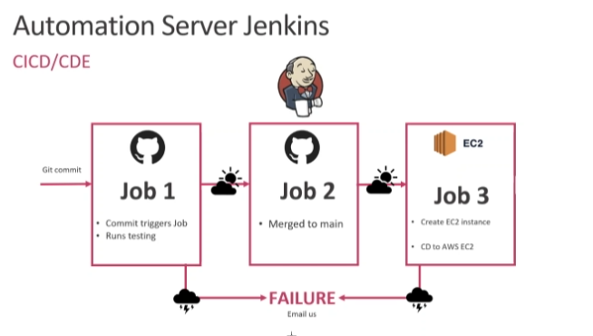


### Job 1, 2 and 3 : What do they mean?
**************
<br>

* A Jenkins job, also known as a build job or pipeline, is a task or set of tasks that Jenkins executes as part of a continuous integration (CI) or continuous deployment (CD) process. 
  
* These jobs define the steps needed to build, test, deploy, and deliver software applications automatically


We will be setting up 3 jobs as paer of our CI/CD pipeline. Have a look at teh diagram above. What role does each job have?

* Job 1 and 2 are Contrinious Intergration phase of the CICD pipeline.

* Job 3 is the phase of Continious Delivery.


#### Job 1 : 
  Here we are looking to test the application on the Dev branch, ensuring its stabilty before integration into the main branch.

  **What does the job do?**
  * It creates a dev branch with Git
  * Tests the Npm on the Dev branch 
  * It uses a webhook to change to code changes 
  * It execites the command for testing npm instillation and running tests 


#### Job 2 : 
  Once Job 1 has been sucessful and does its job, Job 2 handles the merging of that branch to the main branch 

  **What does the job do?**
  * It configures GitHub details and merge settings
  * merges the Dev branch with the main branch
  * It ensures CI by only triggering if Job 1 has worked.


#### Job 3 : 
 Job 3 starts the CD phase of our pipeline by deploying the code from the main branch to production. It our case the aws cloud.

  **What does the job do?**
  * Retrieves the code from the main branch 
  * Pushes the code to the production environment, in our case a e2 instnace
  * It makes sure network security are correct by configuring the port settings 
  * Then it installs all depedencies the instance needs to run 


## Setting up a CI/CD job in jenkins


Okay how do we actually set up these jobs in Jenkins? 

Lets do job 1 first...the steps below!

1. **Log into jenkins**. The link can be found here [Jenkins login](http://35.176.161.147:8080/login?from=%2F)

2. **Click New item** 

3. **Enter name** You can put ```<your name> - Ci```

4. **Select Freestyle project** then click enter
    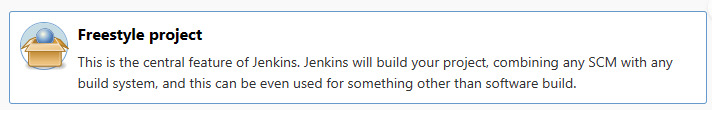

5. **Add a description to your project** you could call it ```building ci for node.js app```

  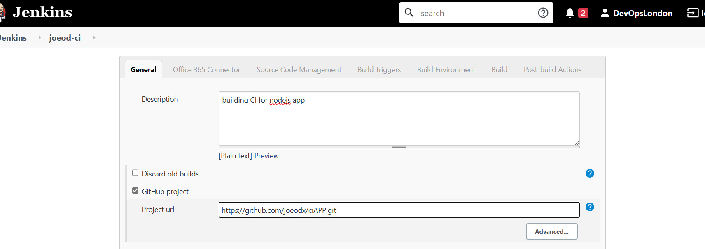

6. **Make Sure to limit to a maximum of 3 job** as you dont want the server to break down. 

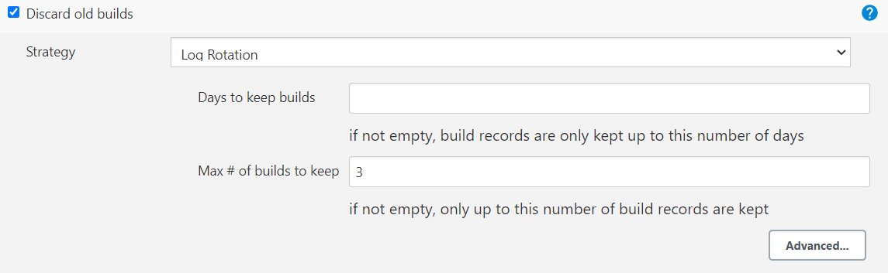

7. **Add Github and input URL** this is where you add the url of the github repo that holds your app. In my case it was 
```git@github.com:joeodx/tech258_cicd.git```. You can go to your github code page to find yours if needed.

1. **Click on the option that says restrict where this project can run** then where it says label expression type ```sparta-ubuntu-node```

  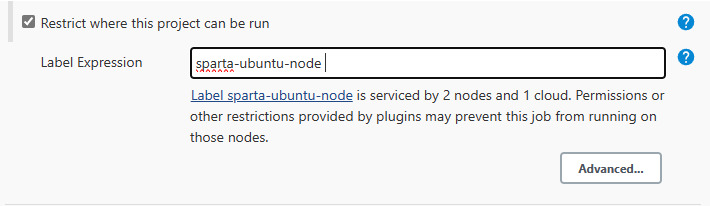

 8. **Click on the git button under source managment** and input the url of your git repo. 
  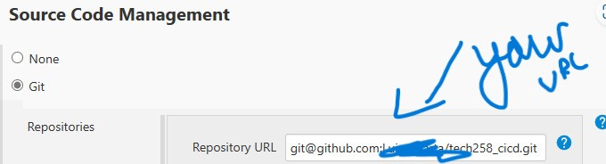

9. **Now put in your private SSH key** where it stayed credentials. You should have it saved.


10. **Make sure you change the branch supplier** to ```*/dev```

11. **In build environment, tick enable Provide node and npm bin/ folder to PATH** you need to configure the environment to include the node.js and npm binary folders in the PATH. 
 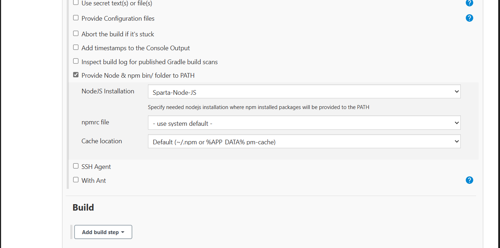

12. **Click the add build step and then click execute shell** 

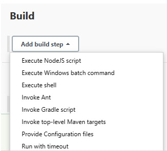

13. **Now add the following command into that execute shell** this will be executed as part of the build process.

```
cd
cd npm install
npm test
```
### Adding a web hook

Now we are going to add a web hook. The steps are as follows : 

1. **Go to build triggers section in jenkins** and tick the github hook trigger for GIT polling option. This wil ltell jenkisn to trigger builds automatically whenevere we make chanes and push to the github repo.

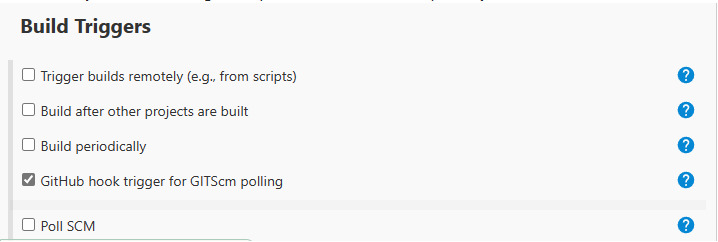

1. **Go to that githubs repo settings, then click on the webhooks section** and then click add webhook.
   
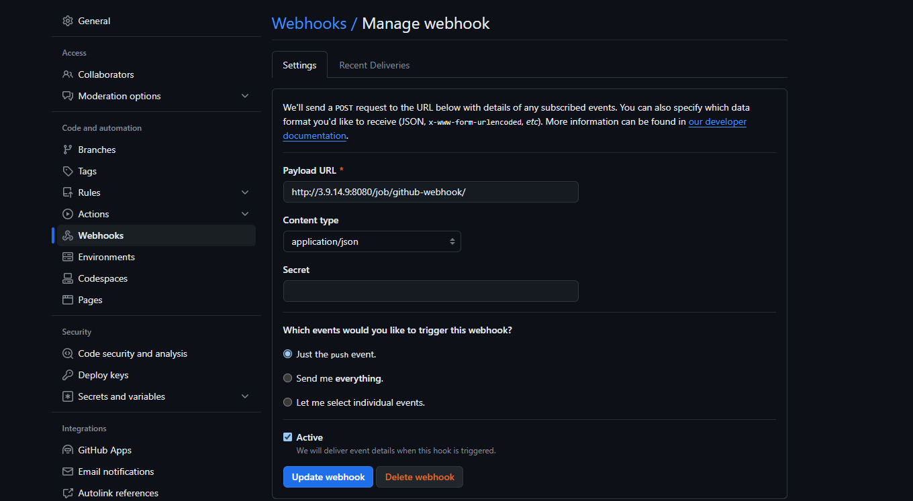

3.**Change the playload URL input to the jenkins Url** so github can send the data to jenkins. For example I used ```http://3.9.14.9:8080/github-webhook/```

4.**Change the content type** to application/json. **Then enable just he push event** option 

5. **Then go back to your job on jenkins and got to the build triggers section** and tick the ```Github hook trigger for GITscm polling```

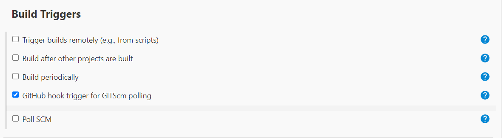


1.  **Click save and apply** button when you have finished 
 


15. **Click run build on the left hand side tab** then check the console outlook, just in case there was any issues.
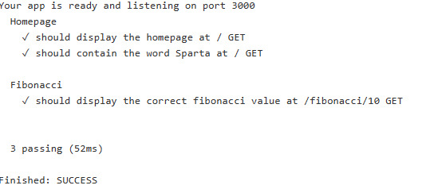


****************************


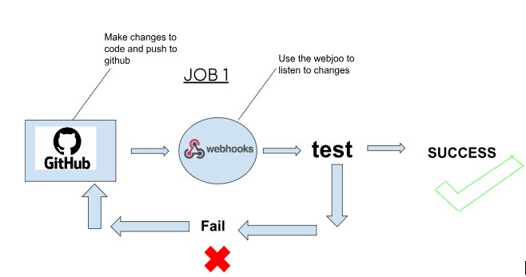

*****************************

## Job 2 steps 

Now lets complete job 2. What was it again? Good time for a reminder. We need to create a job that automatically merges the changes that have been checked by job 1 from the ```dev branch``` to the ```main branch```.


1. **Create a dev branch on your main branch by usign the following command**
  ```
  git checkout - dev
  ```

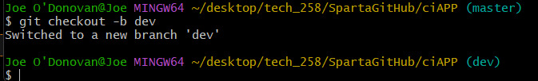

2. **Make a change locally then push to GitHub**

3. **Using the testing job we made for job 1 above** trigger the next job to merge code from your branch ```dev``` to ```main```


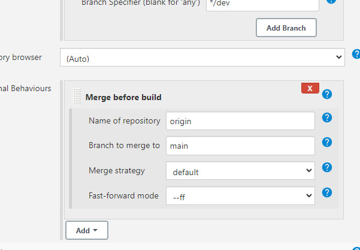


5.**Configure the post build actions** to as follows : 

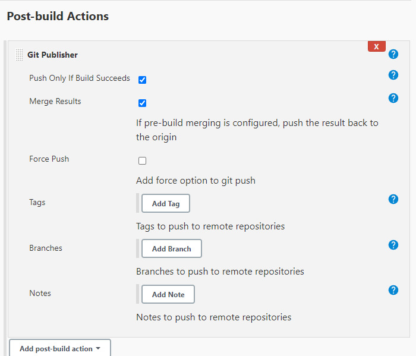
 
6. **Now select apply and save and run that machine**


**Click run build on the left hand side tab** then check the console outlook, just in case there was any issues.


*********************************************

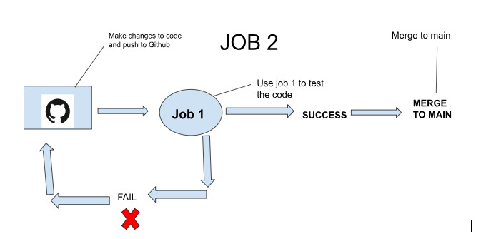


## Job 3 steps - CD 


Now lets complete job 3. What was it again? Good time for another reminder. We need to create a job that does all teh steps before and copy our app code to production. In our case it will be a ec2 isntance on AWS.

Lets do it manually first : 


 

1. **Create an EC2 instance with Ubuntu 18.04LTS** Ensure that it allow the ports for ```jenkins 8080```, ```ssh 22```, ```localhost 3000``` and ```http 80```

2. **You need the job to clone the app code over from the main repo** 
using
 ```git clone```

3. **Install required dependencies** such as node.js 

4. **Now lets ssh into our e2 isntance and manually start the app there**  
*************************

## Job 4 - CD deploy to cloud  


Now lets complete job 4. What was it again? We need to do waht we just did automatically(Without any manual input). The follwing steps show how : 

1. **When configuring the job, go to the source code managment tab** and make it look like below 

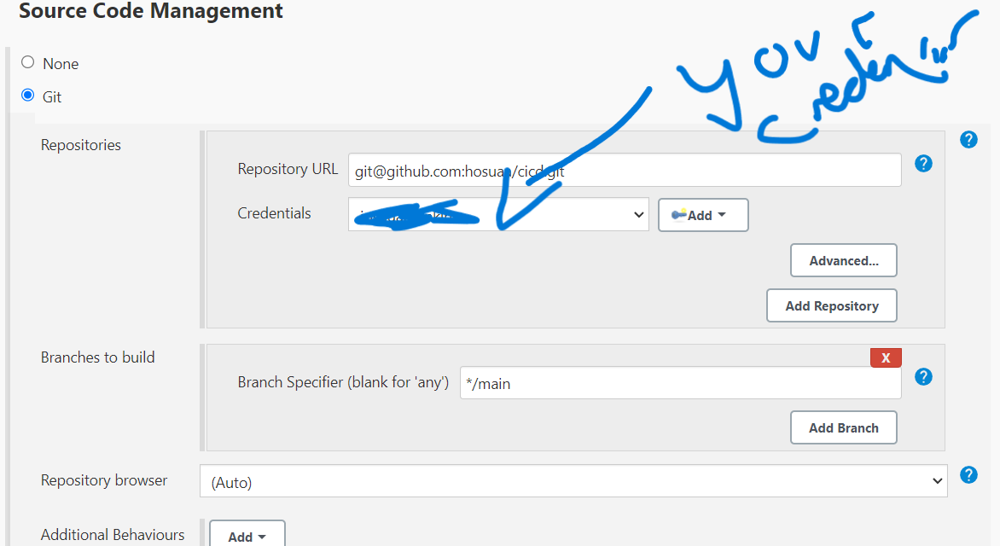

2. **Click on the provide node & npm bin folder to path option** and ssh ahent to tech258.pem

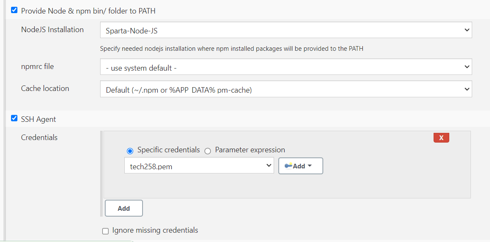

3. **Now when you get to the execute shell tab, add the script to 
deploy your app automatically** 

```
# Bypass key checking option using StrictHostKeyChecking and SSH into EC2
ssh -o "StrictHostKeyChecking=no" ubuntu@34.244.217.61 <<EOF
# Run update & upgrade
sudo apt-get update -y
sudo DEBIAN_FRONTEND=noninteractive apt-get upgrade -y
# Install, restart and enable Nginx service
sudo DEBIAN_FRONTEND=noninteractive apt-get install nginx -y
sudo systemctl restart nginx
sudo systemctl enable nginx

EOF
# Copy new code (app & environment folders) to App Instance
rsync -avz -e "ssh -o StrictHostKeyChecking=no" app ubuntu@34.244.217.61:/home/ubuntu
rsync -avz -e "ssh -o StrictHostKeyChecking=no" environment ubuntu@34.244.217.61:/home/ubuntu
# SSH back in, Navigate to and run script to install app dependencies
ssh -o "StrictHostKeyChecking=no" ubuntu@34.244.217.61 <<EOF
sudo chmod +x ~/environment/app/provision.sh
sudo bash ./environment/app/provision.sh
# Navigate to app directory
cd app
# Gracefully kill/start a new app process using pm2
pm2 stop all
pm2 start app.js app
EOF

```


* Lets go through some of these commands below : 

* Use ```StrictHostKeyChecking=no``` to avoid user input when SSHing in.
* ```rsync``` copies the files over
* ```provision.sh``` contains most of the dependencies
* We can now manually SSH in. We have to also install npm and pm2
```sudo apt install npm```
```sudo npm install pm2@2.6.0 -g```
This could be ran in the script too
* Now simply cd to app, then  **pm2 start app.js** to start the app in the background


4. 2. **Now you can see if you add the public IP** to your url you  should see the app.

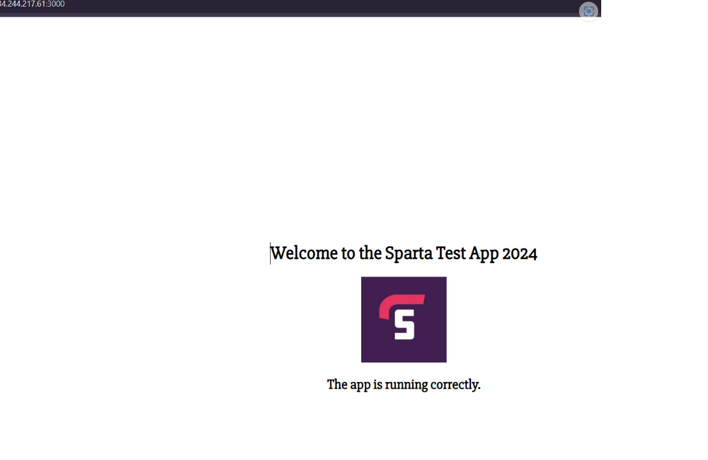
************************************************


