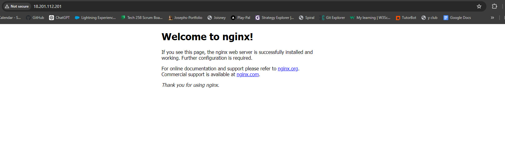

# Ansible architecture on Ansible controller & Agent node/s 


Ansible is an open-source automation tool used for configuration management, application deployment, and task automation. Its architecture is relatively straightforward:

**What is Ansible's architecture?**
* Ansible's architecture is a system designed for automation, primarily used for configuration management, application deployment, and task automation in IT environments.

**Where does Ansible operate?**
* Ansible operates on a controller node, which is typically a machine where Ansible is installed and from where tasks and playbooks are executed. It interacts with managed nodes, which are the machines or devices that Ansible manages and automates tasks on.

**How does Ansible work?**
* Ansible works by executing tasks and playbooks defined in YAML format on managed nodes via SSH connections. It communicates with the managed nodes to gather information using facts and then executes tasks using modules, which are standalone scripts.

**Why use Ansible's architecture?**
* Ansible's architecture provides a simple, agentless, and efficient way to automate IT tasks. It allows for easy scaling, configuration management, and deployment across diverse environments. By using Ansible, organizations can streamline operations, improve consistency, and reduce manual intervention, leading to increased productivity and reliability in IT infrastructure management.


# Configurating managment using Ansible!


1. **Create 3 instances on AWS** You need an instance for you ```app```, your ```database``` and ```controller```,

2. **SSH manually into all three instaces and add the following commands** : 

```sudo apt update```
```sudo apt upgrade```

3. **Now add the following commands to the controller instance** 

```sudo apt-get install software-properties-common```
```sudo apt-add-repository ppa:ansible/ansible```
```sudo apt-get update -y```
```sudo apt-get install ansible -y```
```sudo apt-get install ansible```

4. **Ansible is found in** ```/ect/ansible``` directory.

5. **To check what version you have of ansible** try the following command ```ansible --version```

6. **Now we need to check the controller has access to our app instance and db instance** we can use the module ping from ansible to check 
```sudo ansible -m ping app```

7. **Now you have isntalled it** make sure to ``cd`` into ansible directory and then the following command ```sudo nano hosts```

8. **This is where we are going to put the public ip adresses of both our app instnace and our db instance** so add the following to this file : 
```
   [app]
 
3.255.104.195 ansible_user=ubuntu ansible_ssh_private_key_file=~/.ssh/tech258.pem
 
[db]
 
3.255.112.50 ansible_user=ubuntu ansible_ssh_private_key_file=~/.ssh/tech258.pem

```


9. **We need to now scp our private key from local host to contoller** with the following command 
```scp -i ~/.ssh/tech258.pem ~/.ssh/tech258.pem ubuntu@ip:~/.ssh/```


10. **Then run sudo chmod 400 key_name to make it read only by owner** (necessary step otherwise key could become invalidated)
   

11. **Now run the command** 

```
sudo ansible web -m ping
```

  You should see both your app instance and db instance responding to the ping with pong.


***************

## Adhoc commands 

* We can now run Linux commands from the controller without ansible being installed on the agent(it is agentless) using the following command
```sudo ansible app -a "[command]"```

* You can run a command on all devices with all ```sudo ansible all -a "uname -a"```

* To copy a file from the controller to all agents: ```sudo ansible all -i hosts -m copy -a "src=/home/ubuntu/testing-controller.txt dest=/home/ubuntu/testing-controller.txt```

* You can check this command went through with ```sudo ansible all -a "ls"```


**********************************************************


# Creating a ansible playbook to install nginx on our app instance PLAYBOOKS
*********************************

1.**Create a new playbook** with the command ```sudo nano nginx-play.yml```

2. **Within that script copy this next bit of code** : 

```
# creating a playbook to install, configure nginx in the web server
---
# YAML starts with 3 dashes (best practice)
# to indent use space not tab (esp on vscode)
 
# add the name of the host (app)
- hosts: app
 
# see the logs (gather facts)
# this belongs to the host (with 2 spaces: inline with the 'h' of hosts)
  gather_facts: yes
 
# provide admin access - sudo
  become: true
 
# add instructions to install nginx on the app
# now tasks has a block, so indent it again
# name is for logs
# state=present means nginx is in a running state
  tasks:
  - name: Installing Nginx web server
    apt: pkg=nginx state=present

```

3. **Now run that playbook with the following command** ```sudo ansible-playbook nginx-play.yml```

4. **You should ge tthe follwoing message if it has been sucessfull**


5.**Put the public ip address of your app instance** in the browser to see nginx installed!



***************************************


# Install node, npm and launjch app on port 3000 using a playbook 

*****************************************

1.**Create a new playbook** with the command ```sudo nano nginx-play.yml```

2. **Within that script copy this next bit of code** :
```
# Playbook to install Sparta web server application on 'web' agent node
---
- hosts: web
# see the logs while the script is running so we can see the result
  gather_facts: yes
# provide admin access
  become: true
# outline tasks
## task 1 - update and upgrade agent node
  tasks:
  - name: Update and upgrade apt packages
    apt:
      upgrade: yes
      update_cache: yes
      cache_valid_time: 86400 #One day
## task 2 - install nxginx
  - name: Installing Nginx web server
    apt: pkg=nginx state=present
## task 3 - install node
  - name: Installing Node.js
    apt:
      name: nodejs
      state: present

## task 4 - update and upgrade agent node
  tasks:
  - name: Update and upgrade apt packages
    apt:
      upgrade: yes
      update_cache: yes
      cache_valid_time: 86400 #One day

## task 5 - install npm
  - name: Installing npm
    apt:
      name: npm
      state: present

  - name: download latest npm + Mongoose
    shell: |
      npm install -g npm@latest
      npm install mongoose@ -y

## task 6 - update and upgrade agent node
  tasks:
  - name: Update and upgrade apt packages
    apt:
      upgrade: yes
      update_cache: yes
      cache_valid_time: 86400 #One day

## task 7 - clone app

  - name: clone app github repository
    git:
      repo: https://github.com/joeodx/ciAPP.git
      dest: /tech258-cicd
      clone: yes
      update: yes
## task 8 - install pm2
  - name: install pm2
    shell: |
      cd /tech258_cicd/app
      npm install -y
      npm install pm2@4.0.0 -g

## task 9 - launch app with pm2
  - name: launch app with pm2
    shell: |
      cd /tech258_cicd/app
      pm2 stop app
      pm2 start app.js
```

* Run this playbook with the follwoing command ```sudo ansible-playbook node-play.yml```

3.**If sucessful, you should see the following in your terminal** 

`[](terminal.jpg)

4.**In the URL of your web browswer** type the following ```<yourpublicip>3000``` to see if the app has sucesfully loaded.


******************************************

# Configuring Mongod with ansible  


