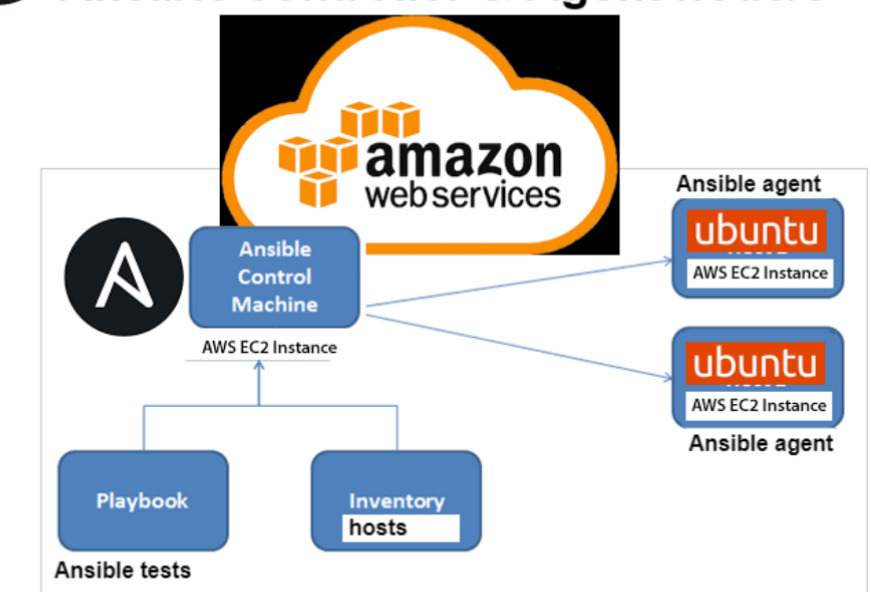

# Ansible architecture on Ansible controller & Agent node/s 

* Ansible is an open-source automation tool used for configuration management, application deployment, and task automation. Its architecture is relatively straightforward:

