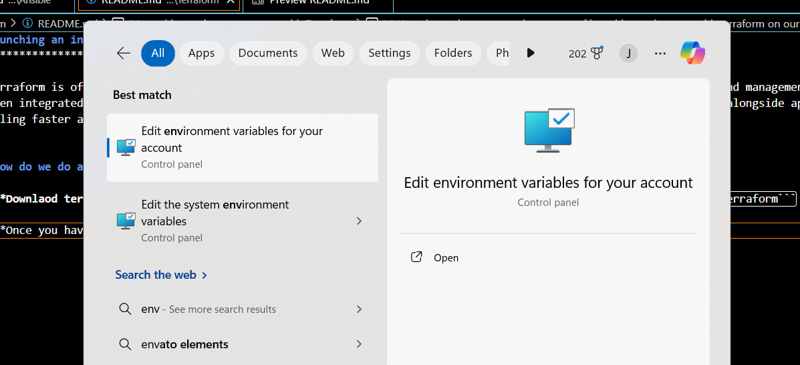
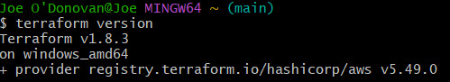
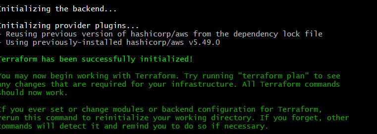
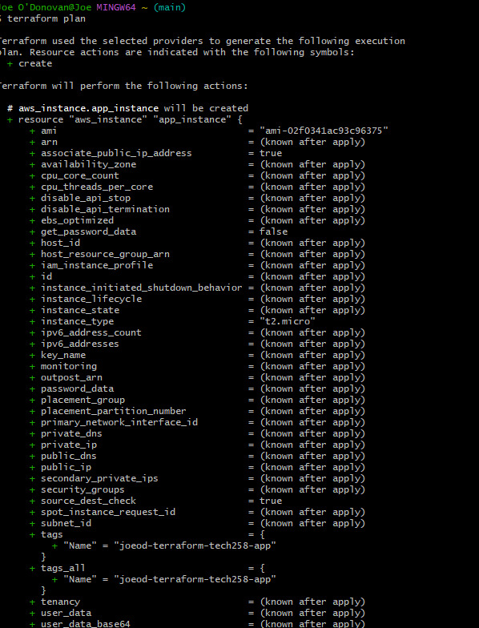
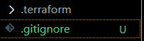
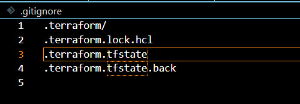
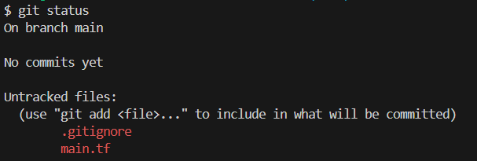

# Launching an instance on aws with Terraform
************************************************

* Terraform is often a key component in DevOps practices due to its ability to automate infrastructure provisioning and management. 
* When integrated into a DevOps workflow, Terraform helps streamline the deployment and management of infrastructure alongside application code,  enabling faster and more reliable software delivery.


## How do we do automate the process of launching an instance with terraform on our local host 
**********************************

1. **Downlaod terraform here** [https://developer.hashicorp.com/terraform/tutorials/aws-get-started/install-cli](download here!) once you have downloaded terraform unzip it and save it in your home directory as ```terraform```

2. **Once you have doen that in your search bar** search for ```environmental variables```



3. **Click on environemental variables** and then ``path`` and then ```edit``` and type in the path where your terraform folder is.
In my case it was ```C:/terraform```

4. **Now to check that has been installed** open a git bash terminal and type in ```terraform --v``` you should get the following shown if it has been sucessfully isntalled. 



5. **Now that has been installed we need to create a pathway** TO OUR ```AWS_ACCESS_KEY_ID``` and our ```AWS_SECRET_KEY```. 

6. **Make sure to have those on hand and go into environmental variables once again** and click new and give them both their name and paste in the keys where it says ```value```

7. **Now open a brand new gitbash terminal** and type the following command ```terraform init``` to run terraform. If you have been sucessful you should see the following on your terminal: 



8. **Now we are going to create the ``.tf`` file that will hold our script to create an instance** and deploy to aws. So type the following command ```nano main.tf```

9. **Add the following to the script**

```
  GNU nano 7.2                                                                                         main.tf                                                                                          Modified
#Create a service o nthe cloud - launch an ec2 instance on aws
# HCL syntax key = value
# which part of aws
provider "aws" {

        region="eu-west-1"
}

# which service
resource "aws_instance" "app_instance" {

# which ami
       ami = "ami-02f0341ac93c96375"

# t2 micro
       instance_type ="t2.micro"

# assosciate public ip with this address
        associate_public_ip_address = true

# which controller (micro)
        tags = {
             Name = "joeod-terraform-tech258-app"
        }
}
```

!!! IT IS IMPORTANT NOT TO HARD CODE YOUR KEYS INTO THE SCRIPT !!!

10. **Save that file and then type the following command** ```terraform plan``` which will see if the script has been checked to work. You should see soemthing like this on your terminal : 



11. **If you have been sucessfull** type the following command to launch the application ```terraform apply```. 

12. **Terraform will ask if you want to proceed like below** type yes. 

 .jpg)

13. **Log into Aws, go to instances and see if your instance is running** if it has you have been sucessfull!

* To termiante your instance use the following command ```terraform destroy ```

*****************************************


## Keeping your terraform files secure

* We need to keep our terraform files secure as it will contain our access keys. We dont want this leaking ot the web.


1. **Open your file that you have made your terraform filkes in Github** Then create a ``gittignore`` file in your repo like below : 

 

2. **Add those files you want ot keep secure to that gitignore file** like below 
   


3. **Next run git status** with the follwoing command ``git status`` and if you see the follwing that is correct 👍



*************************************


## Luanching a EC2 instance with subnet and security groups configured using terraform.

* Lets say we 


