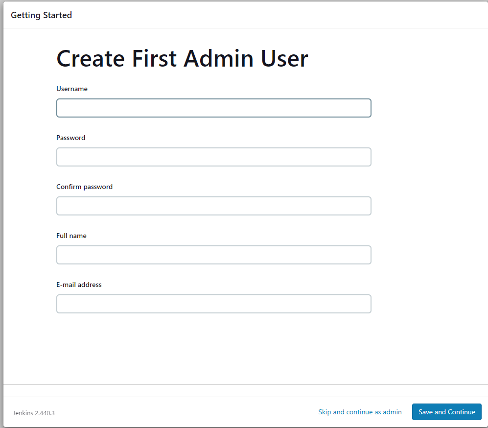
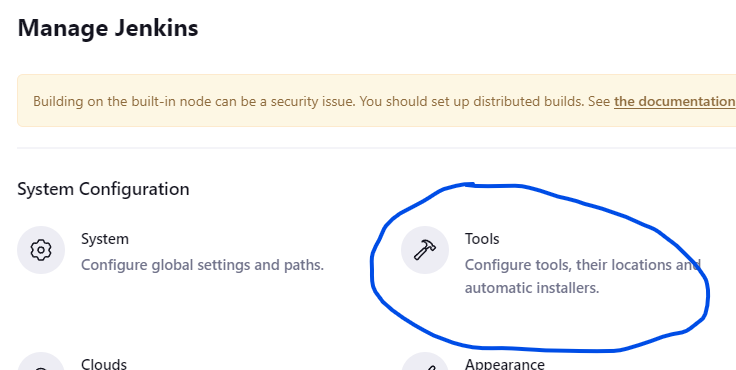
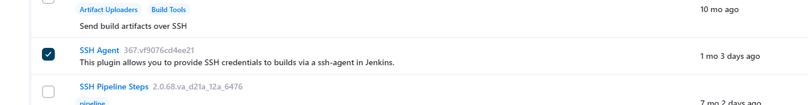
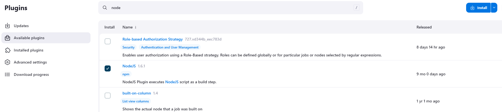
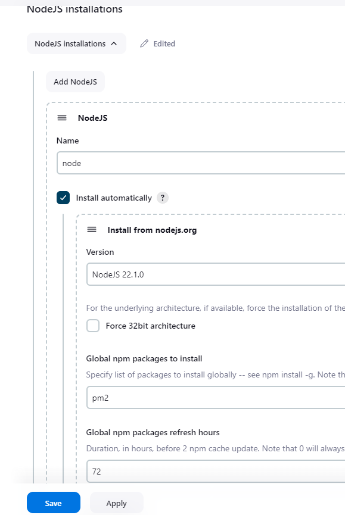
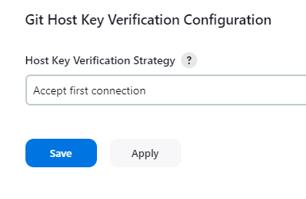

# Making a jenkins server 
*********************

We can create our own Jenkins server and then make our jobs on there!

How do we do it....The following steps!


1. **Create a ubuntu instance on AWS** - use version (22.04)

2. **Once made ssh into your instance via git bash** this is where we are going to install java and jenkins.

3. **Type in the following script from the jenkins website** to install java and jenkins 

```
#!/bin/bash
sudo apt update -y
sudo apt install fontconfig openjdk-17-jre -y
java -version

sudo wget -O /usr/share/keyrings/jenkins-keyring.asc \
  https://pkg.jenkins.io/debian-stable/jenkins.io-2023.key
echo "deb [signed-by=/usr/share/keyrings/jenkins-keyring.asc]" \
  https://pkg.jenkins.io/debian-stable binary/ | sudo tee \
  /etc/apt/sources.list.d/jenkins.list > /dev/null
sudo apt-get update -y
sudo apt-get install jenkins -y
```
4. **Connect to it usign the public ip and adding ```8080`` to the end** jenkisn will be listening on that port.

5. **Type in the follwoing password** you can find it with this command 
```
sudo cat /var/lib/jenkins/secrets/initialAdminPassword
``` 

6. **On the next screen click install suggested plugins** 


6. **On the next screen create an admin user suggested plugins** 


7. **Go to the plug in page and isntall node and ssh agent**




8. **Now go to tools and enable node.js installation**
    

9.**On security tab, allow first tiem connections in git host key** otherwise your instnace wont connect



10.**Now you can create the jobs that you want to make** 
The link here is on how to create jobs : 


***************************

